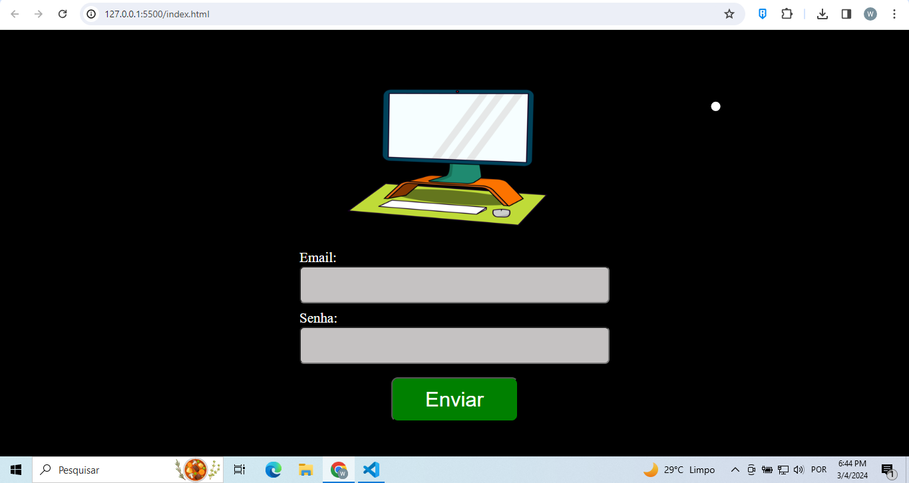

## Olá Pessoal, aqui é o primeiro desafio da Fabrica Software - front-end

- Conceitos básicos do front-end.
- Uso do HTML para marcação da estrutura do site.
- Uso de arquivo CSS para estilização do formulário proposto.

- Vizualização do Formulário proposto:

